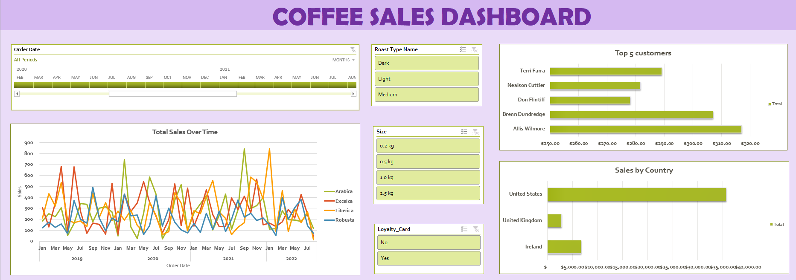

# ☕ Coffee Sales Dashboard

An interactive Excel dashboard analyzing coffee sales across multiple years, countries, customers, and product lines. Built with PivotTables, dynamic formulas, and slicers to deliver a clean, filterable view of business performance.

---

## 📌 Overview

This project transforms raw coffee order data into a fully interactive sales dashboard. It tracks total sales across **2019–2022**, broken down by:

- 📅 Time (yearly and monthly trends)
- 🌍 Country
- 👤 Top customers
- ☕ Coffee type (Arabica, Excelsa, Liberica, Robusta)
- 🔥 Roast type (Light, Medium, Dark)
- 📦 Package size (0.2 kg, 0.5 kg, 1.0 kg, 2.5 kg)
- 💳 Loyalty card status

---

## 📸 Dashboard Preview



> *Screenshot of the final dashboard with slicers, timeline, and charts.*

---

## ✨ Features

- **Dynamic Slicers** — Filter instantly by Roast Type, Size, and Loyalty Card
- **Timeline Filter** — Zoom into any month/year between 2019 and 2022
- **Total Sales Over Time** — Multi-line chart tracking 4 coffee types across 4 years
- **Top 5 Customers** — Horizontal bar chart ranking top buyers (Terri Farra, Nealson Cuttler, Don Flintiff, Brenn Dundredge, Allis Wilmore)
- **Sales by Country** — Bar chart comparing United States, United Kingdom, and Ireland
- **Auto-Lookup Formulas** — Customer names, emails, and product details pulled automatically via `XLOOKUP` and `INDEX/MATCH`
- **Revenue Calculation** — Sales column auto-computed as `Quantity × Unit Price`

---

## 🗂️ Workbook Structure

| Sheet | Purpose |
|-------|---------|
| **Dashboard** | Interactive visual summary |
| **TotalSales** | PivotTable — monthly sales by coffee type and year |
| **SalesByCountry** | PivotTable — total sales grouped by country |
| **Top5customers** | PivotTable — top 5 buyers by revenue |
| **orders** | Raw order records with lookup formulas |
| **customers** | Customer master data (names, emails, addresses, loyalty) |
| **products** | Product catalog (unit price, profit margin, size, roast) |

---

## 🔧 Key Formulas Used

**1. Customer Name Lookup** (in `orders` sheet):
```excel
=XLOOKUP(C2, customers!$A:$A, customers!$B:$B, , 0)
```

**2. Email Lookup (returns blank if empty):**
```excel
=IF(XLOOKUP(C2, customers!$A:$A, customers!$C:$C, , 0) = 0, "",
    XLOOKUP(C2, customers!$A:$A, customers!$C:$C, , 0))
```

**3. Product Detail Lookup (Coffee Type, Roast, Size, Unit Price):**
```excel
=INDEX(products!$A$1:$G$49,
       MATCH(orders!$D2, products!$A$1:$A$49, 0),
       MATCH(orders!I$1, products!$A$1:$G$1, 0))
```

**4. Total Sales:**
```excel
=L2 * E2
```

**5. Coffee Type Name (mapping abbreviations):**
```excel
=IF(I2="Rob","Robusta",
  IF(I2="Exc","Excelsa",
   IF(I2="Ara","Arabica",
    IF(I2="Lib","Liberica",""))))
```

**6. Loyalty Card Lookup:**
```excel
=XLOOKUP(Orders_Table[[#This Row],[Customer ID]],
         customers!$A$2:$A$1001,
         customers!$I$2:$I$1001, , 0)
```

---

## 📊 Dataset Summary

| Metric | Value |
|--------|-------|
| Total Records (orders) | 1,000 |
| Time Range | 2019 – 2022 |
| Countries | United States, United Kingdom, Ireland |
| Coffee Types | Arabica, Excelsa, Liberica, Robusta |
| Roast Levels | Light, Medium, Dark |
| Package Sizes | 0.2 kg, 0.5 kg, 1.0 kg, 2.5 kg |
| Products | 48 unique SKUs |

---

## 🛠️ Tools & Techniques

- **Microsoft Excel** — PivotTables, PivotCharts, Slicers, Timeline
- **Dynamic Arrays** — `XLOOKUP` for robust lookups
- **INDEX + MATCH** — Two-way lookup for product details
- **Named Tables** — `Orders_Table` for structured references
- **Conditional Formatting** — Highlight key metrics
- **Data Validation** — Ensures clean data entry

---

## 🚀 How to Use

1. **Clone or download** this repository
2. Open `Coffee_Sales_Project.xlsx` in Excel (2019 or later recommended for `XLOOKUP`)
3. Navigate to the **Dashboard** sheet
4. Use the **slicers** on the right to filter by Roast Type, Size, or Loyalty Card
5. Use the **timeline** to zoom into specific months or years
6. All charts and KPIs update automatically

---

## 💡 Key Insights

- 🇺🇸 **United States** dominates sales, far outpacing the UK and Ireland
- 🏆 **Allis Wilmore** is the top customer, followed by **Brenn Dundredge** and **Terri Farra**
- 📈 **Liberica** shows strong seasonal spikes (notably in late 2020 and early 2021)
- 🔥 **Medium roast** is the most popular roast type across all sizes
- 💳 Loyalty card holders represent a significant portion of repeat purchases

---

## 📁 Repository Structure

```
Coffee_Sales/
│
├── Coffee_Sales_Dashboard.png     # Dashboard screenshot
├── Coffee_Sales_Project.xlsx      # Main workbook (dashboard + pivot tables)
├── coffeeOrdersData.xlsx          # Raw source data (orders, customers, products)
└── README.md                      # Project documentation
```

---

## 🔮 Future Improvements

- [ ] Migrate to **Power BI** for advanced interactivity
- [ ] Add **profit margin analysis** using the `Profit` column
- [ ] Build a **forecasting model** for 2023 sales
- [ ] Automate data refresh with **Power Query**
- [ ] Add **month-over-month growth %** KPIs

---

## 👤 Author

**Navya**
- GitHub: [@navya21feb](https://github.com/navya21feb)

---

## 🙏 Acknowledgments

- Dataset inspired by real-world coffee sales data
- Built as part of an Excel data analytics portfolio project
- Dashboard design inspired by common BI best practices

---

⭐ **If you found this project helpful, please consider giving it a star!**
